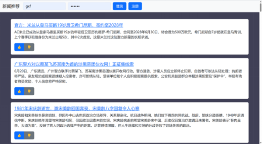

**新闻推荐平台**
## **1 项目简介**
1. **项目概要**

本项目专门设计了一个新闻推荐平台，用户可以在平台上观看到热门新闻的简要内容，如果对相关类容有兴趣还可以通过提供的网站跳转到详细新闻平台。如果用户登入了平台后，还可以对新闻进行评价(赞或者踩)，然后平台可以根据用户对新闻的评价进行推荐新闻。

1. **主要功能**

1.2.1爬取热点新闻然后处理后在平台上显示

1.2.2 通过用户的对新闻的评价，进行推荐新闻

**1.3 实现情况**

数据的爬取、数据的处理、在前端的显示、在数据库的保存、用户的登入和注册、新闻的推荐功能都以及实现。不够再推荐算法和推荐的方式都采用了比较简单的方法

1. **项目的开发环境/运行环境**
1. **window系统**
1. **Python 3.11.3** 
   1. **项目的github托管网址**

[**https://github.com/the-bright-stars/python_work/**](https://github.com/the-bright-stars/python_work/)

## **2 项目开发中的难点问题**

1. 爬取数据时出现的问题

原来可以访问的网站后来电脑端却不可以访问，起初我认为可能是平台封了我的ip。但是我改ip后还是不行，但同一ip的手机端却可以访问网站。尝试过修改请求头的代理方式也还是不行。最后发现只有修改系统代理才能够访问。

1. 在前端界面设计的问题

因为之前还没有学过前端，所以在前端界面的搭建遇到了很多莫名其妙的错误。

1. 在数据结构上的问题

因为在不同的数据要在不同的函数或程序之间流通，所以设计合理的结构很重要。起初的设计在后来功能不断完善下发现了越来越多的不合理的地方甚至是行不通的地方，结果就只能重新设计了。

1. 在推荐算法上的问题

由于平台限制，我只设计了“赞或者踩”的评价方式，这样生成的数据可能不太够。已经在推荐算法的选择上，目前只是采用简单的加权求和的方式。

## **3 采用的关键技术或主要方法**
3.1 前端

前端设计上采用的是经典的三大件

3.2 后端

后端设计上使用了python的flask框架

3.3 数据库

数据库选择使用sql，因为后端使用的是flask框架所以数据库与后端的连接选择使用SQLAlchemy工具

3.4 数据获取、处理以及推荐算法

新闻数据是通过requests包获取的然后用BeautifulSoup和lxml的内核保存下来。由于原新闻可能过长通过大模型对新闻对关键内容进行提取。通过jieba提取新闻的关键字，在通过加权求和算法将用户偏好关键字与新闻关键字就行计算相似度最后进行推荐。
## **4实现效果及分析**

4.1 主要界面

4.1.1 这是平台的主界面，用户可以获取热点新闻的推荐，如果还想获取详细的新闻可以通过链接来访问。

4.1.2 在主界面的上方提供的登入和注册的按键

4.1.3 在主界面的“赞或者踩”按键在未登入是不能按的，否则会出现以下警告

4.1.4 在注册界面，需要先输出邮箱才能获取验证码，否则或发出警告

4.1.5 在输入邮箱后“获取验证码”将改为“已成功发送”切无法在点击

4.1.5 如果邮箱重复创建、验证码不对、确认密码与密码不同都会有相应的警告

4.1.6 如果成功创建将跳转到主界面去，然后登入成功就会有以下反馈

4.1.7 登入成功后主界面将变成这样

4.18 在这个界面用户就可以进行正常的评价了，不过每个用户对于一篇文章只有一次评价的机会，可以进行多次，但每次都会覆盖上一次的结果

4.1.9 在登入成功后主界面将有个“复制api的信息”的按键，当用户点击后可以获取专属于之间的api，用户可以提供get的请求获取平台提供的新闻推荐。成功复制有如下反馈。

4.1.11在登入成功后主界面用户可以通过点击退出键返回到主界面，在退出后浏览器和后端都会删除用户的cookie。

4.1.12 通过api 用户可以获取平台新闻推荐，其有如下信息：状态码："code"，反馈信息： "message", 新闻的数目："total", 数据最后更新日期："updateTime"，推荐新闻数据："data"。

其中的推荐新闻数据中是按照推荐级别从高到低排列的。

4.2 爬取数据的程序

4.2.1 由于数据爬取和处理时，比较消耗时间，如果将相关程序放在flask框架里面，那么将到用户再访问时将十分缓慢，影响体验。所以将爬取数据包装到单独的程序里面，因此数据的生成还要启动其他程序。

4.2.2 以下数据是dict\_news.json里的，对最原始的排行榜数据

4.2.3 以下数据是data1.json里的，是根据dict\_news.json中的网站爬取的数据，并且包含了文章的关键字
## 
4.2.4 以下数据是data2.json里的，因为data1.json中的content数据过于长不适合再平台直接显示，所以通过大语言模型对content提取关键内容

## **5 总结**
这是我完成第一个这么完整的项目，其中包括了前端、后端以及数据库。其中遇到了很多的困难，不过通过查去资料大部分的还是都解决了。因为在前端、后端以及数据库上的花的时间太多了，导致了本项目目前在数据处理、推荐算法和推荐方式方面做了都比较简单，如数据处理方面本来想自己建模型的，结果只是采用了jieba工具和开源大模型，在推荐方式上，本来打算将文字和图片结合成海报的形式来分享的，但是目前只完成的api的分享。
